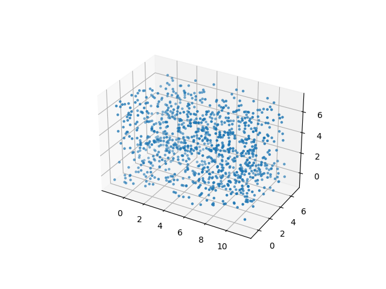
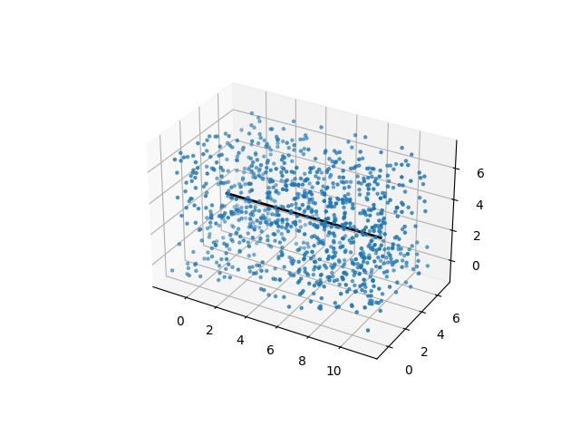
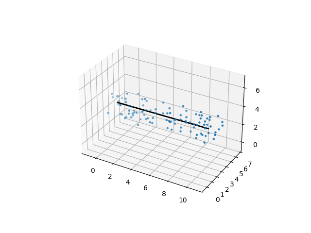
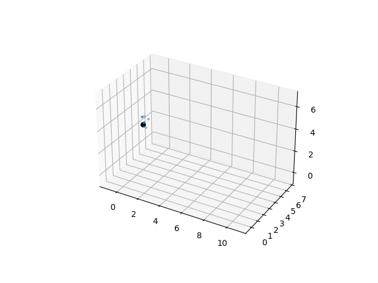

# sempy: Synthetic Eddy Method in Python

<p align="center">
    <picture>
      <source media="(prefers-color-scheme: dark)" width="800" srcset="https://github.com/kaschau/sempy/blob/main/docs/images/sempySplash.jpg">
      <source media="(prefers-color-scheme: light)" width="800" srcset="https://github.com/kaschau/sempy/blob/main/docs/images/sempySplash.jpg">
      
    </picture>
</p>

## Attribution

Use the following BibTex citation to cite sempy in scientific discourse.

``` bibtex
@article{schau2022ensemble,
  title={An ensemble Synthetic Eddy Method for accurate treatment of inhomogeneous turbulence},
  author={Schau, Kyle A and Johnson, Chelsea and Muller, Julia and Oefelein, Joseph C},
  journal={Computers \& Fluids},
  volume={248},
  pages={105671},
  year={2022},
  publisher={Pergamon}
}
```

## About

Python implementation of the Ensemble Synthetic Eddy Method.

The key to understanding how sempy works is to understand how SEM works. Read the Jarrin thesis [here](./References/Papers/Synthetic-Inflow-Boundary-Conditions-for-the-Numerical-Simulation-of-Turbulence_2008.pdf).

There is one key distinctions in how sempy and most SEM implementations work. Instead of creating a small box around our inlet surface and convecting eddys past the inlet plane, sempy creates a mega box and convects the inlet (or just individual points) through the mega box. This leads to a lot of advantages in terms of performance, accuracy, and experimentation. For one, it makes the signal generation a pre-processing step for analysis and verification before run time, not after. Second, with the entire signal known, we can manipulate it to produce more accurate results, see publication. 

Here is an example of how we [generate fluctuations](./sempy/generatePrimes.py) in sempy.

We begin by populating a mega box with eddys. This mega box is wide and tall enough to encompass our inlet plane, and long enough to traverse through it for as long as we want our signal to be.



With sempy, you generate an entire signal at a single (y,z) point on the inlet plane. When we know this point, we can draw a "time line" down the domain. Traversing down this line is like traversing forward in time.



One way we get performance savings is by filtering out all eddys that do not effect any points on this line. We can find this out using the eddy sigma values. All points in which sigmas do not extend across this line will not contribute to this point's fluctuation signal.



With this reduced set, we can much more quickly perform the SEM calculations. Next, we start at time = zero. We can further filter out eddys too far into the future to effect this time. We compute the sum of the contributing eddys for this point in time, then march forward to the next point in time. We repeat this until a signal of the desired length is computed. We then move onto the next point of interest.



As each point on the inlet plane is independent of the other points on the inlet plane, and the synthetic eddys are static, we processes groups of inlet points in parallel. We store the discrete inlet signal as cubic polynomial coefficient allowing reconstruction of the signal at arbitrary time steps at run time.

You then can view the inlet fluctuations superimposed onto a predefined profile.

